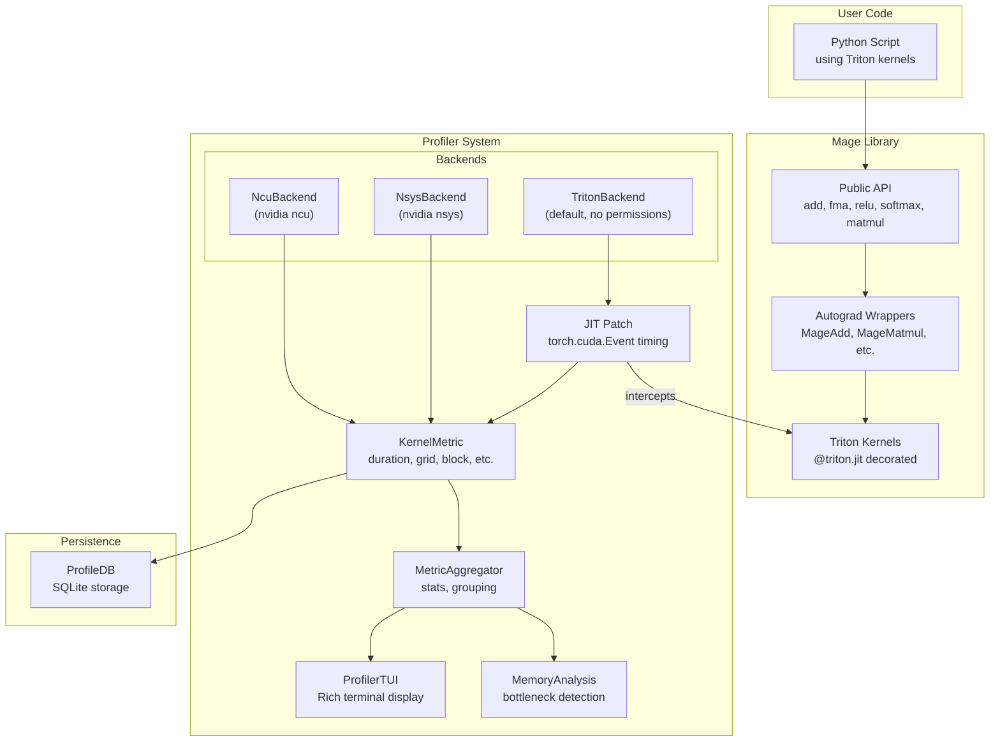
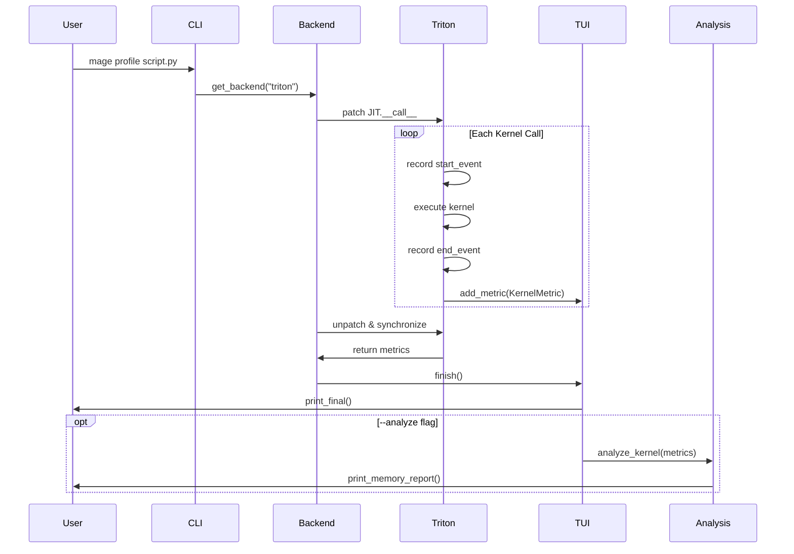
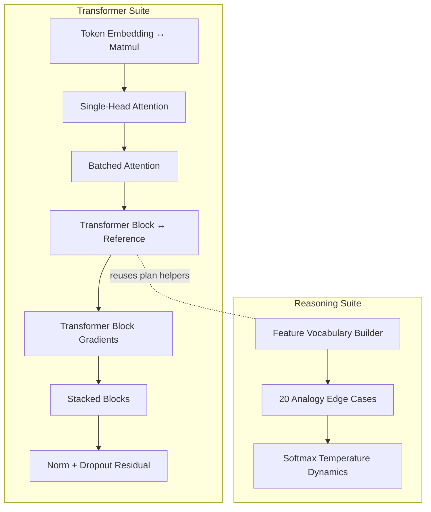

# Mage

**Composable Triton CUDA kernels, native Rust CUDA experiments, and GPU profiling.**

[Mathematical field notes](https://superposition.github.io/mage/) ·
[Superposition journal](https://superposition.github.io/) ·
[PyTorch / Triton / Rust profile graphs](https://superposition.github.io/mage/experiments/mage-001/#profiles)

## The research notebook

Mage is also an open investigation into the mathematics and physical work behind
GPU computation. The [Superposition blog](https://superposition.github.io/)
follows the motivation, discoveries, and changes of mind; Mage holds the kernels,
profiling tools, and reproducible evidence.

- [Why this notebook: thinking above the code](https://superposition.github.io/journal/why-this-notebook/) — where the investigation begins.
- [A faster call can hide a slower kernel](https://superposition.github.io/journal/faster-calls-slower-kernels/) — what the first three-way profiles change about the question.
- [Computation is also movement](https://superposition.github.io/mage/experiments/mage-001/) — the mathematical ideas, interactive graphs, and production tradeoffs.
- [Continue the kernel exploration](docs/research/kernel-exploration.md) — the next experiments, implementation priorities, and criteria for an informative result.

The current comparisons cover five forward FP32 operations on an RTX 4090.
They include improvements and regressions; they are not a general ranking of
Python, Triton, or Rust. Start with the [measurement record](docs/experiments/mage-001-comparison.md)
before interpreting the graphs. Questions and corrections are welcome via
[Telegram @SuprPosition](https://t.me/SuprPosition).

### Rust CUDA experiments

Build the five FP32 examples with pinned cuda-oxide tooling, validate shared inputs
against PyTorch, then profile the native executable with the same Mage display and
SQLite history. The existing Python/Triton workflow remains available.

```bash
mage profile-exec --backend nsys --capture-range cuda --output-dir artifacts/trace -- \
  examples/oxide/target/release/mage-oxide artifacts/mage-001/matmul --capture
```

See the [WSL2 setup and reproduction guide](https://github.com/superposition/mage/blob/master/docs/guide.md).

## Features

- High-performance Triton kernels: `add`, `fma`, `relu`, `softmax`, `matmul`
- Autograd wrappers for Mage's training operators; the Rust/Triton research examples are forward-only
- Built-in Triton event profiler with TUI (no special permissions needed)
- Nsight Systems/Compute for Python scripts and native executables; Compute requires counter access
- Memory analysis with roofline model diagnostics

## Installation

```bash
pip install -e .
```

## Quick Start

```python
import torch
import mage

# Call Mage's Triton implementation through its Python API
x = torch.randn(1024, 1024, device="cuda", dtype=torch.float16)
y = torch.randn(1024, 1024, device="cuda", dtype=torch.float16)

result = mage.matmul(x, y)  # Autograd-compatible
```

## Architecture



## Profiler Flow



## Example Output

### Demo

```
$ mage demo
Device: NVIDIA GeForce RTX 4090

add:     max diff = 0.00e+00 OK
fma:     max diff = 0.00e+00 OK
relu:    max diff = 0.00e+00 OK
softmax: max diff = 4.77e-07 OK
matmul:  max diff = 3.91e-03 OK
```

### Profiling

```
$ mage profile script.py --analyze
Profiling script.py with triton...
This may take a moment...

╭─────────────────────── GPU Profiler - python script.py ────────────────────────╮
│ Kernel                      │ Duration │  Grid   │  Block  │ Threads │         │
│─────────────────────────────┼──────────┼─────────┼─────────┼─────────┼─────────│
│ matmul_kernel               │  142.37  │ 32,32,1 │ 128,1,1 │ 131072  │         │
│ matmul_kernel               │  138.24  │ 32,32,1 │ 128,1,1 │ 131072  │         │
│ softmax_kernel              │   18.43  │ 1024,1,1│ 128,1,1 │ 131072  │         │
│ add_kernel                  │    5.12  │ 4096,1,1│ 128,1,1 │ 524288  │         │
│─────────────────────────────┼──────────┼─────────┼─────────┼─────────┼─────────│
│ TOTAL (4 kernels)           │  304.16  │    -    │    -    │    -    │         │
╰───────────────────── 0.3s │ 4 metrics │ 4 kernels │ Complete ──────────────────╯

Summary
────────────────────────────────
Total metrics: 4
Unique kernels: 4

Duration (μs):
  Total: 304.16
  Mean:  76.04
  Min:   5.12
  Max:   142.37

Top kernels by total time:
  matmul_kernel: 280.61 μs
  softmax_kernel: 18.43 μs
  add_kernel: 5.12 μs

╭─────────────────────────── GPU Specifications ───────────────────────────╮
│ NVIDIA GeForce RTX 4090                                                  │
│ Memory: 24GB @ 1008 GB/s                                                 │
│ Compute: 82.6 TFLOPS (FP32)                                              │
│ Balance Point: 81.9 FLOPs/byte                                           │
╰──────────────────────────────────────────────────────────────────────────╯

              Memory Analysis Summary
┏━━━━━━━━━━━━━━━━━┳━━━━━━━━━━━┳━━━━━━━━━┳━━━━━━━━━━━┓
┃ Kernel          ┃ Duration  ┃ BW Util ┃ Bottleneck┃
┡━━━━━━━━━━━━━━━━━╇━━━━━━━━━━━╇━━━━━━━━━╇━━━━━━━━━━━┩
│ matmul_kernel   │ 142.37μs  │    -    │  UNKNOWN  │
│ softmax_kernel  │  18.43μs  │    -    │  UNKNOWN  │
│ add_kernel      │   5.12μs  │    -    │  UNKNOWN  │
└─────────────────┴───────────┴─────────┴───────────┘

Roofline Analysis:
  • Ridge point: 81.9 FLOPs/byte
  • Below 82 FLOPs/byte → Memory-bound
  • Above 82 FLOPs/byte → Compute-bound
```

## Test Coverage



- **Embedding & Attention**: `tests/test_tensor_transformer.py` ensures `tensor_join` matches dense matmul and `torch.einsum` across token embedding, attention projections, and batched attention scores.
- **Full Blocks**: Transformer block parity, gradient consistency, and stacked block propagation validate end-to-end equivalence with PyTorch references.
- **Stability Extras**: Layer norm, residual connections, and dropout paths confirm parity even with stochastic masking when seeds align.
- **Analogical Reasoning**: A handcrafted feature vocabulary encodes shapes, colors, sizes, materials, and patterns to check 20 analogy transformations via `tensor_join`.
- **Temperature Dynamics**: Softmax sampling at multiple temperatures confirms confidence calibration while preserving the correct top choice.
- **Execution Tip**: Run the focused suites with `uv run pytest tests/test_tensor_transformer.py -k transformer` or `-k reasoning` to iterate quickly.

## Graphical Models in Tensor Logic

| Component | Tensor Logic Implementation |
|-----------|-----------------------------|
| Factor | Tensor |
| Marginalization | Projection |
| Pointwise product | Join |
| Join tree | Tree-like program |
| \(P(\text{Query}\mid\text{Evidence})\) | `Prog(Q,E) / Prog(E)` |
| Belief propagation | Forward chaining |
| Sampling | Selective projection |

### Benchmarks

```
$ mage bench matmul
Device: NVIDIA GeForce RTX 4090
CUDA Version: 12.4

Matmul Benchmarks (fp16)
================================================================================
┏━━━━━━━━━━━━━━━┳━━━━━━━━━━━━━┳━━━━━━━━━━━━━┳━━━━━━━━━━┓
┃ Size          ┃ Triton (ms) ┃ PyTorch (ms)┃ Speedup  ┃
┡━━━━━━━━━━━━━━━╇━━━━━━━━━━━━━╇━━━━━━━━━━━━━╇━━━━━━━━━━┩
│ 512x512       │   0.042     │    0.038    │  0.91x   │
│ 1024x1024     │   0.089     │    0.091    │  1.02x   │
│ 2048x2048     │   0.312     │    0.318    │  1.02x   │
│ 4096x4096     │   1.847     │    1.892    │  1.02x   │
└───────────────┴─────────────┴─────────────┴──────────┘
```

## CLI Commands

```bash
mage demo              # Quick correctness check
mage bench [op]        # Run benchmarks (all, add, matmul, relu, softmax, backward)
mage profile script.py # Profile a Python script
mage profile -m pkg.module:fn  # Profile a function

# Profile options
mage profile script.py --backend triton   # Default, no permissions needed
mage profile script.py --backend nsys     # NVIDIA Nsight Systems
mage profile script.py --backend ncu      # NVIDIA Nsight Compute
mage profile script.py --analyze          # Include memory analysis
mage profile script.py --columns kernel,duration,grid
mage profile -m pkg.module:fn --call-args '[1, 2]' --warmup 5 --iterations 20
```

## Programmatic Profiling

```python
from mage.profiler.backends.triton_profiler import profile_triton

with profile_triton() as profiler:
    # Your Triton kernel code here
    result = my_kernel[grid](x, y, BLOCK_SIZE=1024)

for metric in profiler.get_metrics():
    print(f"{metric.kernel_name}: {metric.duration_us:.2f} μs")
```
